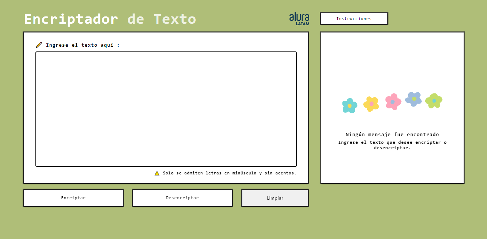

#  🍓 - Encriptador de Texto 

Sistema que permite encriptar o desencriptar un texto ingresado por el usuario bajo determinados criterios de encriptación establecidos.

#  💻 - Desarrollado con 

# 📷 -  Muestra

 

# 🔎  - Código de Encriptación
| Llave | convertido a | Valor |
| :---: |     :---:    | ---   |
| e | ⇔ | enter |
| i | ⇔ | imes |
| a | ⇔ | ai |
| o | ⇔ | ober |
| u | ⇔ | ufat |
  

#  📌 - Requisitos
-  La página debe tener campos para la inserción del texto que será encriptado o desencriptado, y el usuario debe poder escoger entre esas dos opciones.
-  Debe ser posible convertir una palabra a su versión encriptada y también devolver una palabra encriptada a su versión original.
-  Debe funcionar solo con letras minúsculas.
-  No deben ser utilizadas letras con acentos ni caracteres especiales.
-  El resultado debe ser mostrado en la pantalla.

# 🌻 - Más información

  <a href="https://www.oracle.com/ar/education/oracle-next-education/">
  

Este desafío forma parte del programa ONE - One Next Education, iniciativa promovida por Oracle y Alura LATAM. Para obtener más información detallada de este desafío visite el siguiente [enlace](https://github.com/alura-challenges/challenge-one-encriptador-latam).
